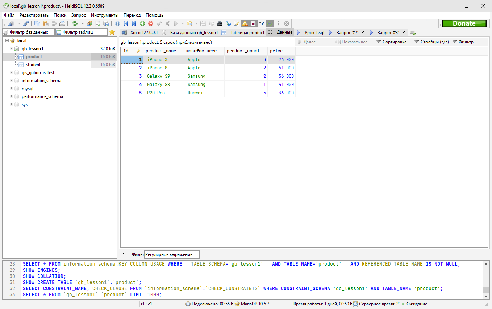

1. Создайте таблицу с мобильными телефонами, используя графический интерфейс. Заполните БД данными. Добавьте скриншот на платформу в качестве ответа на ДЗ



```sql
CREATE TABLE `product` (
	`id` INT UNSIGNED NOT NULL AUTO_INCREMENT,
	`product_name` VARCHAR(50) NOT NULL,
	`manufacturer` VARCHAR(50) NULL,
	`product_count` INT UNSIGNED NULL DEFAULT NULL,
	`price` INT UNSIGNED NULL DEFAULT NULL,
	PRIMARY KEY (`id`)
);

INSERT INTO `gb-sql`.`product` (`product_name`, `manufacturer`, `product_count`, `price`) VALUES ('iPhone X', 'Apple', 3, 76000);
INSERT INTO `gb-sql`.`product` (`product_name`, `manufacturer`, `product_count`, `price`) VALUES ('iPhone 8', 'Apple', 2, 51000);
INSERT INTO `gb-sql`.`product` (`product_name`, `manufacturer`, `product_count`, `price`) VALUES ('Galaxy S9', 'Samsung', 2, 56000);
INSERT INTO `gb-sql`.`product` (`product_name`, `manufacturer`, `product_count`, `price`) VALUES ('Galaxy S8', 'Samsung', 1, 41000);
INSERT INTO `gb-sql`.`product` (`product_name`, `manufacturer`, `product_count`, `price`) VALUES ('P20 Pro', 'Huawei', 5, 36000);
```

2. Выведите название, производителя и цену для товаров, количество которых превышает 2 (SQL - файл, скриншот, либо сам код)
```sql
SELECT product_name, manufacturer, price FROM product WHERE product_count > 2;
```
3. Выведите весь ассортимент товаров марки “Samsung”
```sql
SELECT * FROM product WHERE manufacturer = 'Samsung';
```
4. Выведите информацию о телефонах, где суммарный чек больше 100 000 и меньше 145 000**
```sql
SELECT * FROM product WHERE product_count * price > 100000 AND product_count * price < 145000;
```
4.*** С помощью регулярных выражений найти (можно использовать операторы “LIKE”, “RLIKE” для 4.3 ):
```sql
-- 4.1. Товары, в которых есть упоминание "Iphone"
SELECT * FROM product WHERE product_name LIKE ('%iPhone%');

-- 4.2. "Galaxy"
SELECT * FROM product WHERE product_name RLIKE ('Galaxy');

-- 4.3.  Товары, в которых есть ЦИФРЫ
SELECT * FROM product WHERE product_name RLIKE ('[0-9]');

-- 4.4.  Товары, в которых есть ЦИФРА "8"
SELECT * FROM product WHERE product_name RLIKE ('8');

```
